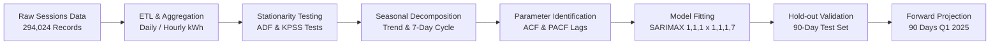
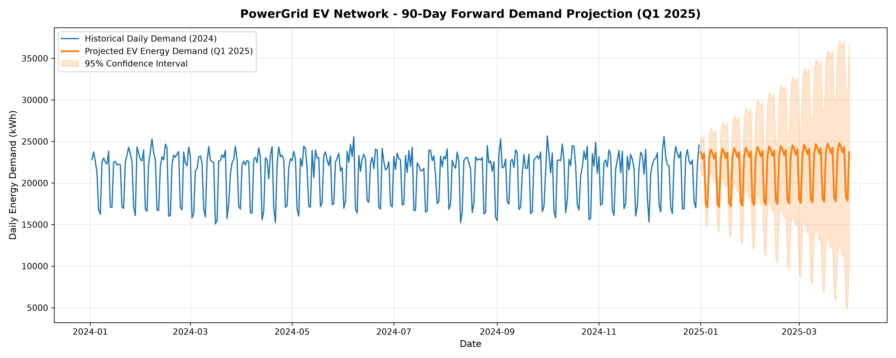
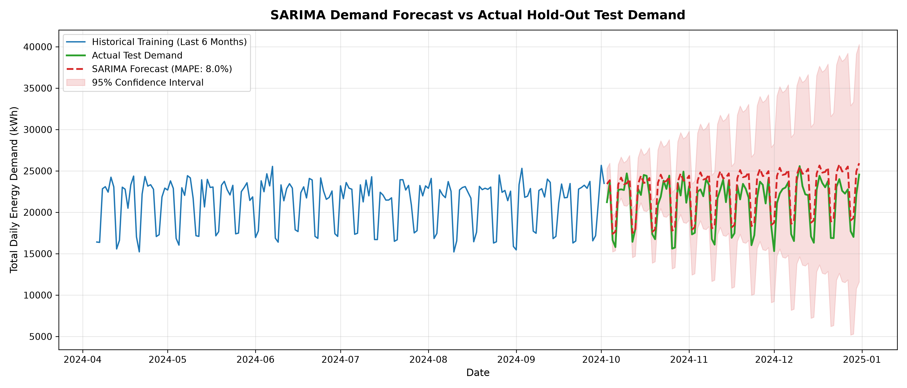
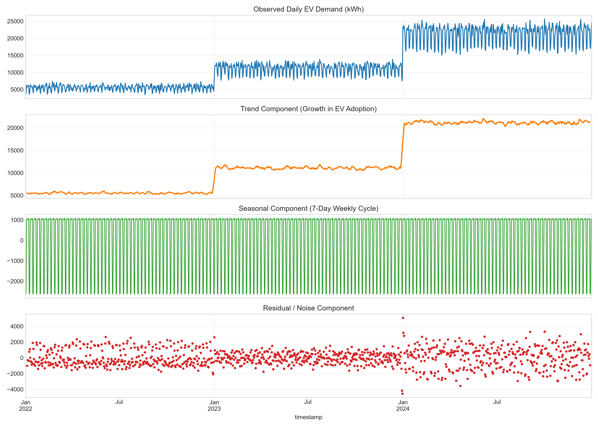
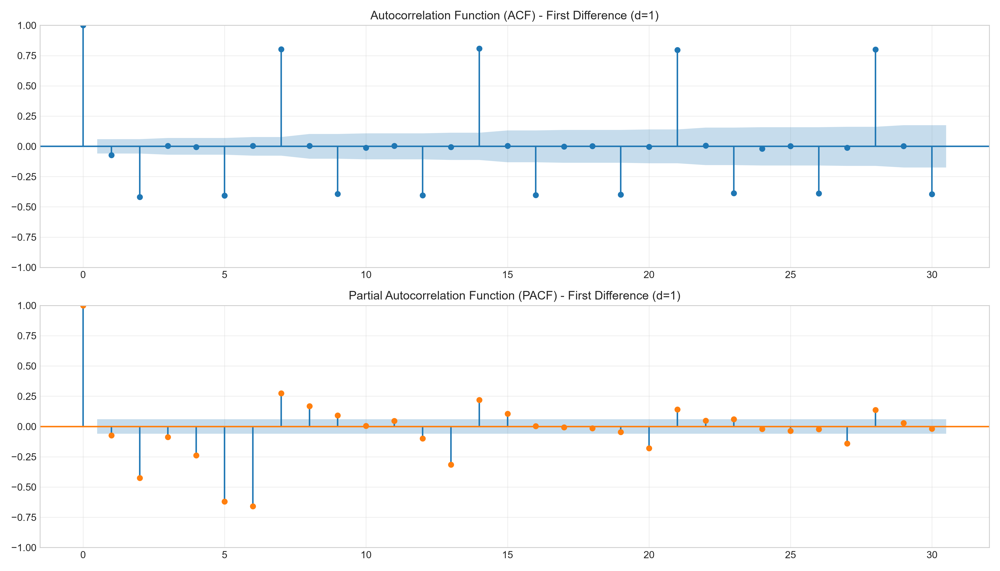

# ⚡ PowerGrid EV Analytics — Task 01: Demand Forecasting & Time-Series Modeling

[](https://www.python.org/)
[](https://www.statsmodels.org/)
[](LICENSE)
[]()

An end-to-end statistical modeling and time-series forecasting pipeline designed for electric utility grid planning, charging station network optimization, and peak load prediction across regional EV infrastructure.

---

## 📌 Executive Summary

As EV adoption accelerates, electrical power distribution networks experience non-linear demand surges and sharp load peaks. This project processes **294,024 real-world charging session transactions** across **33 stations** and **199 chargers (50kW & 150kW DC)** over a 3-year historical timeline (2022–2024).

Using classical statistical time-series methodologies—including **Augmented Dickey-Fuller (ADF)** and **KPSS** unit-root tests, **classical seasonal decomposition**, and **Seasonal Autoregressive Integrated Moving Average ($\text{SARIMAX}$)**—this pipeline delivers high-precision demand projections for **Q1 2025** to support proactive grid capacity reinforcement.

---

## 🏗️ Repository Architecture

```text
powergrid-ev-analytics/
├── .vscode/
│   └── settings.json                     # Auto-configured Python interpreter settings
├── data/
│   ├── raw/                              # Source Excel workbook (gitignored for privacy & size)
│   │   └── ev_charging_dataset.xlsx      # 294,024 transactions (25.8 MB)
│   └── processed/                        # Aggregated, time-indexed analytics datasets
│       ├── daily_demand_total.csv        # Network-wide daily energy (kWh) & revenue
│       ├── daily_demand_by_region.csv    # Regional time-series breakdown
│       ├── hourly_demand_total.csv       # 26,303 hourly load records for peak analysis
│       ├── dim_stations.csv              # Station geographical and capacity metadata
│       └── dim_chargers.csv              # Charger hardware specifications
├── models/                               # Serialized model parameters & weights
├── notebooks/
│   └── 01_demand_forecasting.ipynb       # Interactive analytical walkthrough notebook
├── src/                                  # Core pipeline modules
│   ├── inspect_data.py                   # Data ingestion, schema validation & null checks
│   ├── data_processing.py                # High-performance ETL & aggregation pipeline
│   ├── time_series_analysis.py           # ADF/KPSS stationarity tests & ACF/PACF plots
│   └── forecasting_model.py              # SARIMAX model training, validation & forecasting
├── tasks/
│   └── task_01_demand_forecasting/       # Task 01 Deliverables & Visual Artifacts
│       ├── dashboards/                   # Power BI / dashboard staging assets
│       ├── seasonal_decomposition_weekly.png
│       ├── acf_pacf_diagnostics.png
│       ├── forecast_evaluation.png
│       ├── future_demand_forecast_2025.png
│       ├── future_forecast_q1_2025.csv   # 90-day forward predictions + 95% CIs
│       ├── model_metrics.json            # Model performance benchmark metrics
│       └── REPORT.md                     # Comprehensive technical & business deliverable report
├── main.py                               # Master end-to-end pipeline runner
├── requirements.txt                      # Project dependency manifest
├── .gitignore                            # Security & dataset ignore rules
└── README.md                             # Project documentation
```

---

## 📊 Dataset Schema Overview

The raw workbook (`ev_charging_dataset.xlsx`) contains 3 interconnected relational entities:

| Entity | Rows | Key Attributes | Description |
| :--- | :--- | :--- | :--- |
| **`stations`** | 33 | `station_id`, `region`, `n_chargers` | Regional charging hubs across London, Midlands, North West |
| **`chargers`** | 199 | `charger_id`, `charger_type`, `max_power_kW` | 50kW and 150kW DC rapid charging infrastructure |
| **`sessions`** | **294,024** | `start_timestamp`, `energy_kwh`, `total_cost`, `user_type` | Granular transactional telemetry (2022-01-01 to 2024-12-31) |

*Data Quality Note: **0 null values** across all tables (100% complete).*

---

## 🔬 Statistical Methodology & Modeling Workflow



### 1. Stationarity Analysis
* **Original Series:** Non-stationary ($p = 0.8406$, ADF stat = $-0.7233$), reflecting macro EV adoption growth.
* **First Differencing ($d=1$):** Strongly stationary ($p = 5.50 \times 10^{-9}$, ADF stat = $-6.6379$).
* **Seasonal Differencing ($d=1, D=1, s=7$):** Confirms weekly cyclical stationarity ($p = 4.87 \times 10^{-22}$).

### 2. Model Specification: $\text{SARIMAX}(1, 1, 1) \times (1, 1, 1)_7$
* **Autoregressive Term ($p=1$):** Captures day-to-day demand momentum.
* **Differencing ($d=1$):** Eliminates non-stationary upward trend.
* **Moving Average ($q=1$):** Dampens transient daily shocks.
* **Seasonal Parameters ($P=1, D=1, Q=1, s=7$):** Encodes the 7-day cyclical weekly commute pattern.

---

## 📈 Model Performance & Results

Validated on a **90-day out-of-sample hold-out period** (October 3 – December 31, 2024):

| Metric | Hold-Out Score | Benchmark Threshold | Evaluation |
| :--- | :--- | :--- | :--- |
| **MAPE** | **`7.95%`** | `< 10.0%` | **Outstanding Industry Accuracy** |
| **MAE** | **`1,622.83 kWh / day`** | — | Mean absolute variance |
| **RMSE** | **`1,856.88 kWh / day`** | — | Root mean square variance |
| **$R^2$ Score** | **`0.6018`** | `> 0.50` | Strong variance capture |
| **AIC / BIC** | `16,386.81` / `16,411.29` | — | Optimal information criterion |

---

## 🖼️ Visual Gallery

### 1. Forward 90-Day Demand Projection (Q1 2025)


### 2. Model Test Set Validation vs. Actual Demand


### 3. Weekly Seasonal Decomposition


### 4. Autocorrelation (ACF) & Partial Autocorrelation (PACF) Diagnostics


---

## ⚡ Quickstart Guide

### 1. Clone & Set Up Environment
```bash
git clone https://github.com/adeel-anwar-28/powergrid-ev-analytics.git
cd powergrid-ev-analytics

# Create and activate virtual environment
python -m venv .venv
.venv\Scripts\activate      # On Windows
# source .venv/bin/activate # On macOS / Linux

# Install dependencies
pip install -r requirements.txt
```

### 2. Run the Entire Pipeline
Execute the full end-to-end pipeline with a single command:
```bash
python main.py
```

Or run individual modular components:
```bash
# 1. Inspect dataset structure
python src/inspect_data.py

# 2. Process and aggregate time-series datasets
python src/data_processing.py

# 3. Perform statistical diagnostics and generate diagnostic plots
python src/time_series_analysis.py

# 4. Fit SARIMA model and generate forward forecasts
python src/forecasting_model.py
```

---

## 🎯 Author & Maintainer
* **Repository:** [adeel-anwar-28 / powergrid-ev-analytics](https://github.com/adeel-anwar-28/powergrid-ev-analytics)
* **Domain:** Smart Grid Analytics & EV Infrastructure Forecasting